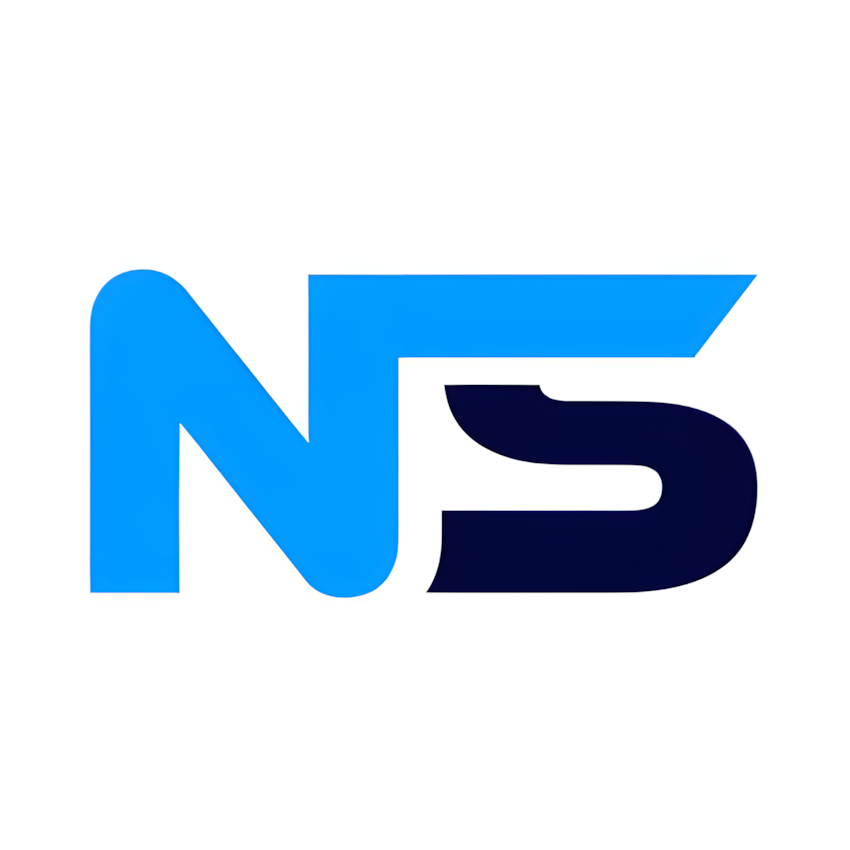

<p align="center">
    
</p>


---

## Neuro Speak Overview

Your own custom uncensored private local text-to-speech program is here! Copy and paste text from a game or book and have TTS read it aloud. Alternatively, it can scan a region on your computer and read text (ie. Renpy games). Download any TTS model from hugging face or use default ones to get started!

I am not an expert, if there is an issue, I may not be able to fix it but I will try.

---

## 💡 Install Instructions

```bash
# Install
git clone https://github.com/ZeusXpresss/Neuro-Speak.git

```

There is a install_dependencies.bat file inside the main folder you will need to run.  This will install all the dependencies and requirements that is needed for the program to work.

You still need to install Tesseract OCR manually. Download it from: [https://github.com/UB-Mannheim/tesseract/wiki](https://github.com/UB-Mannheim/tesseract/wiki)
Default path expected by your program: C:\Program Files\Tesseract-OCR\tesseract.exe


## 💻 How to use
